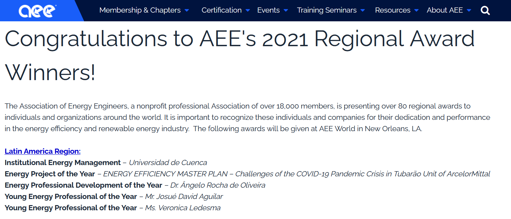
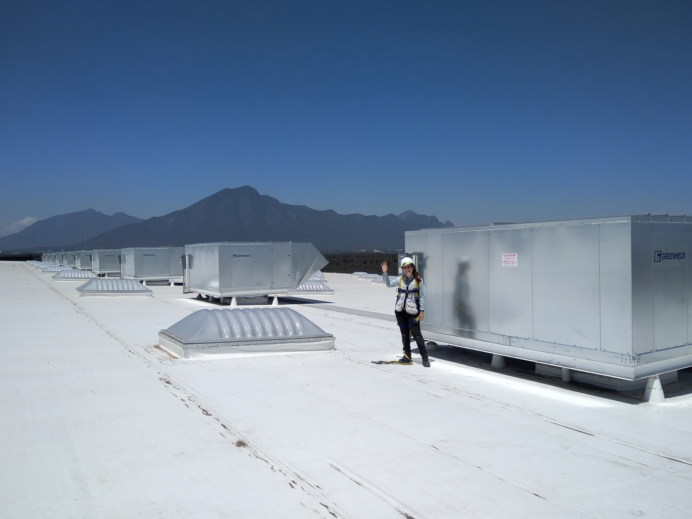
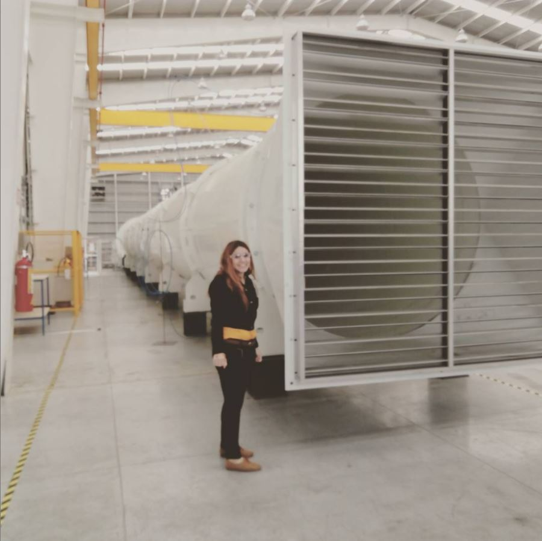

# Awards

## Young Energy Professional of the Year Award 2021

I feel very honored to have received the *[Young Energy Professional of the Year Award 2021](https://www.aeecenter.org/aee-recognizes-individuals-and-organizations-contributions-energy-industry)* by the Association of Energy Engineers. Congratulations to all AEE award winners too!

# Projects

<Row>
<Col>

</Col>
<Col>

</Col>
</Row>

<Row>
<Col>

</Col>
<Col>

</Col>
</Row>

