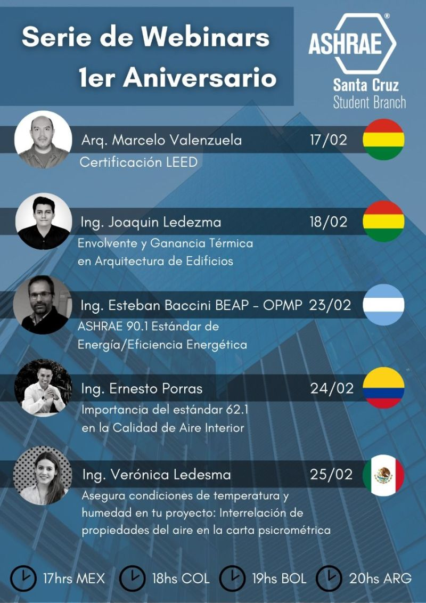
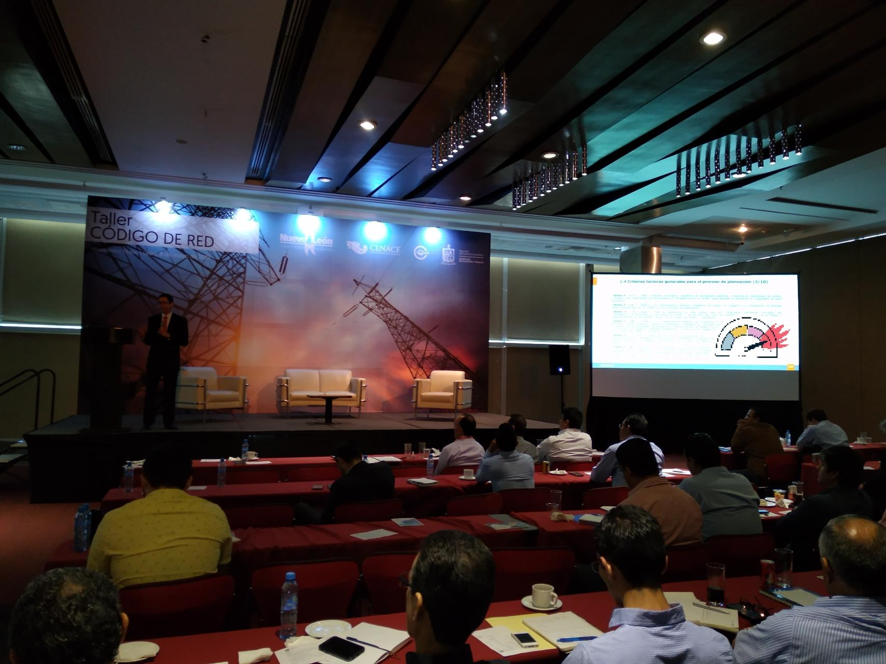

# Seminarios y cursos impartidos

<Row>

<Col>  

## Asegura condiciones de temperatura y humedad en tu proyecto

### Interrelación de propiedades del aire en la carta psicrométrica

Participé en una serie de webinars para celebrar el primer aniversario del *[ASHRAE Santa Cruz](https://www.facebook.com/Ashrae-Santa-Cruz-Student-Branch-104304234488627/)*, donde junto con colegas expertos en aire acondicionado y ahorro de energía compartimos una charla acerca de los temas que nos apasionan.

</Col>

<Col>

</Col>
<Col>

</Col>
</Row>

<Row>
<Col>

</Col>
<Col>  

## Confort térmico
Agradezco la oportunidad que me otorgó el *[ICET Nuevo León](https://www.nl.gob.mx/icet)* para compartir con distintos representantes de la industria los factores más importantes a considerar para el confort térmico. 
Gracias a ustedes comprobé que _**cuando uno enseña, dos aprenden.**_ Espero que este curso basado en el ASHRAE 55 les sea de utilidad.
 
</Col>
</Row>

<Row>
<Col>

## Eficiencia en data centers
Es un placer haber compartido para tan selecto grupo, el *[Colegio de Ingenieros en Energía de México (CIEM)](http://www.ciem.org.mx/)*, sobre los temas que más me apasionan: el ahorro de energía y el aire acondicionado, con el tema _**Oportunidades de eficiencia energética en sistemas de agua helada para data centers**_

Espero que las oportunidades de ahorro presentadas hayan generado valor y que estos puntos se tengan en mente en los diseños HVAC en los que se vean involucrados. 

</Col>
<Col>

</Col>
</Row>

<Row>
<Col>

</Col>
<Col>  

## Edificación sustentable
Tengo el gusto de haber apoyado hablando de lo que me apasiona, impartiendo el taller “Diseñemos un Edificio Eficiente”, con el fin de promover el cumplimiento del objetivo **[Ciudades y comunidades sostenibles](https://onu.org.gt/objetivos-de-desarrollo/)** de la ONU. 

Espero que cada vez seamos más los que nos preocupamos por diseñar los edificios de manera eficiente; que nos puedan encontrar en cada estado, en cada ciudad y en cada proyecto, ingenieros y arquitectos. Que siempre haya alguien en el equipo con los valores, la visión, la pasión, el positivismo, el placer y el interés por decir… _**“muy bien.. y si ahora lo diseñamos sustentable ?”**_

</Col>
</Row>

# Otros eventos

<Row>
<Col>

## Importance of humidity on indoor spaces to reduce COVID-19 propagation
Tuve la oportunidad de asistir al **ASHRAE Houston Chapter**, a la conferencia de la **Dra. Stephanie H Taylor, MD, MArch, FRSPH(UK), CABE, ASHRAE D.L.**, quien gracias a su Maestría en Arquitectura e Ingeniería se enfocó al diseño de hospitales que aceleraran el proceso de curación de los pacientes. Los dos puntos que llamaron más mi atención fueron los siguientes:

1. **La humedad se tiene que mantener ente 40 y 60%.** Este rango de humedad evita la propagación del virus por el aire. Ambientes secos, con humedades por debajo del 40%, incrementan la transferencia del virus increíblemente (nótese que es común que en los aviones la humedad se encuentre por debajo del 20%)

2. **Supervivencia del virus en superficies.** Los virus sobreviven por mayor período de tiempo en superficies no porosos (metales, acero inoxidable, plástico) que en materiales porosos (papel, tela)

</Col>
<Col>

</Col>
</Row>

<Row>
<Col>

</Col>
<Col>

## Energy Summit, Houston TX
Uno nunca termina de aprender: presente en **2020 Energy 2.0 & ERG Summit Houston**

</Col>
</Row>

<Row>

<Col>

## Taller Código de Red
Presente en el taller de código de red impartido por **CENACE** y **Gobierno de NL**

</Col>
<Col>

</Col>
</Row>