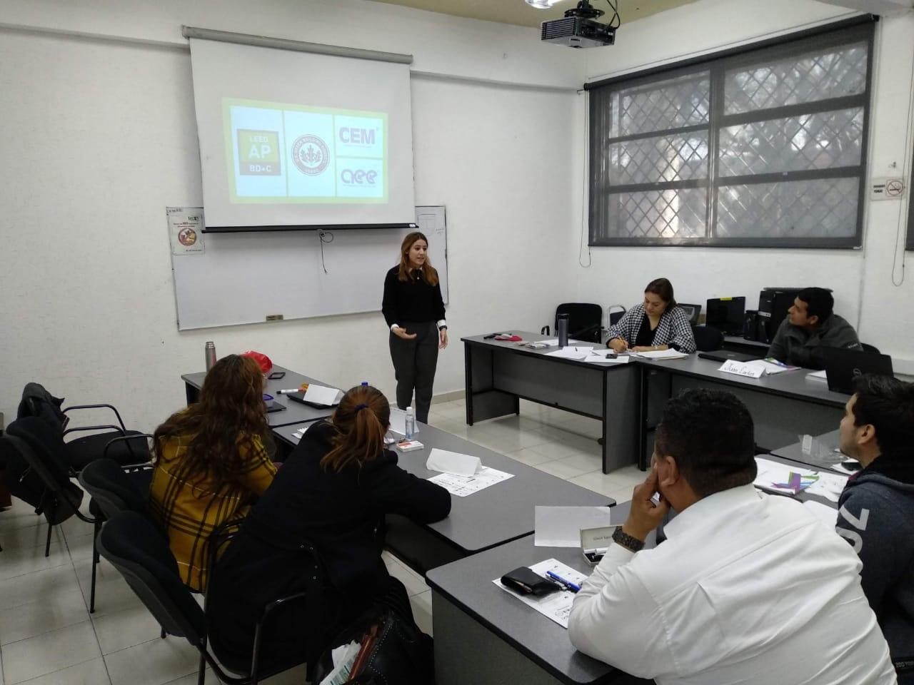

# Seminars and Courses

<Row>

<Col>  

## Ensure temperature and humidity conditions in your project

### Interrelation of air properties in the psychrometric chart

A series of webinars to celebrate the first anniversary of the *[ASHRAE Santa Cruz local chapter](https://www.facebook.com/Ashrae-Santa-Cruz-Student-Branch-104304234488627/)*. Understanding psychrometrics is one of the most powerful tools that an HVAC engineer can have. This talk covered the basics of psychrometrics and explained how far an analysis can go with this knowledge.

</Col>

<Col>

</Col>
<Col>

</Col>
</Row>

<Row>
<Col>

</Col>
<Col>  

## Thermal Comfort
Special thanks to *[ICET Nuevo León](https://www.nl.gob.mx/icet)* for allowing me to share with several industry leaders the most important factors to take into consideration to reach thermal comfort. I hope that this ASHRAE 55 based course met your expectations.
 
</Col>
</Row>

<Row>
<Col>

## Energy Efficiency Opportunities in Chilled Water Systems
It was a pleasure to have shared my knowledge with some of the best engineers in Mexico. Special thanks to the [AEE local chapter Colegio de Ingenieros en Energía de México (CIEM)] (http://www.ciem.org.mx/) for this opportunity. In this talk some different possibilities were analyzed: raising the chilled water supply temperature, increasing the deltaT, redesigning coils, implementing evaporative cooling, changing the control and automation logic, and improving the hydraulic architecture.

</Col>
<Col>

</Col>
</Row>

<Row>
<Col>

</Col>
<Col>  

## Let's Design an Efficient Building - Workshop
I had the pleasure to talk about what drives my passion and to promote compliance with the **[UN sustainable cities goal](https://www.un.org/sustainabledevelopment/blog/category/cities/)**. In the  "Let's Design An Efficient Building" workshop  the participants learned about the main elements that differentiate an efficient building from a standard building.

I hope that every day more engineers and architects care about designing more efficient buildings in every city and country. I would like to create a future where there is passion to always ask ourselves the following question: _**“great... what about now creating a more sustainable design?”**_

</Col>
</Row>

# Other events

<Row>
<Col>

## Importance of humidity on indoor spaces to reduce COVID-19 propagation
I had the opportunity to attend the **ASHRAE Houston Chapter** conference by **Stephanie H Taylor, MD, MArch, FRSPH(UK), CABE, ASHRAE D.L.**. Thanks to her Masters in Architecture and Engineering, she has focused to design hospitals that accelerate the healing process of patients. The points I found the most interesting where:

1. **Humidity must stay between 40 and 60%.** This humidity range diminishes propagation of airborne virus. Dry air with humidity below 40% increases the virus transmission rate. It is also very common that airplanes have humidity below 20%.

2. **Virus surface presence.** Virus survive the longest in non-porous surfaces (metals, steel, plastic) vs in porous materials (paper, cloth)

</Col>
<Col>

</Col>
</Row>

<Row>
<Col>

</Col>
<Col>

## Energy Summit, Houston TX
One can never stop learning: attended the **2020 Energy 2.0 & ERG Summit Houston**

</Col>
</Row>

<Row>

<Col>

## "Código de Red" workshop
Attended this workshop regarding compliance with the newest energy distribution & transmission  local code imparted by **CENACE** and **Gobierno de NL**

</Col>
<Col>

</Col>
</Row>