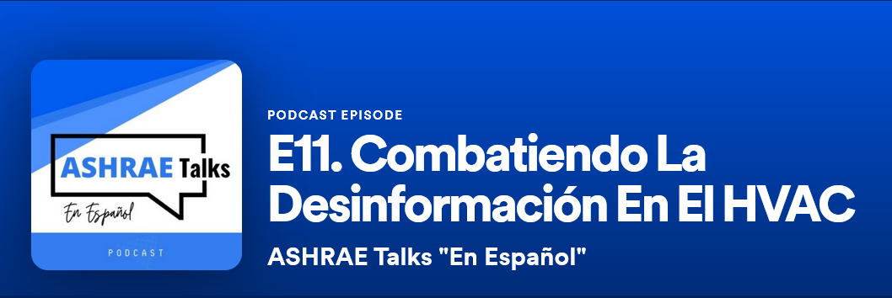
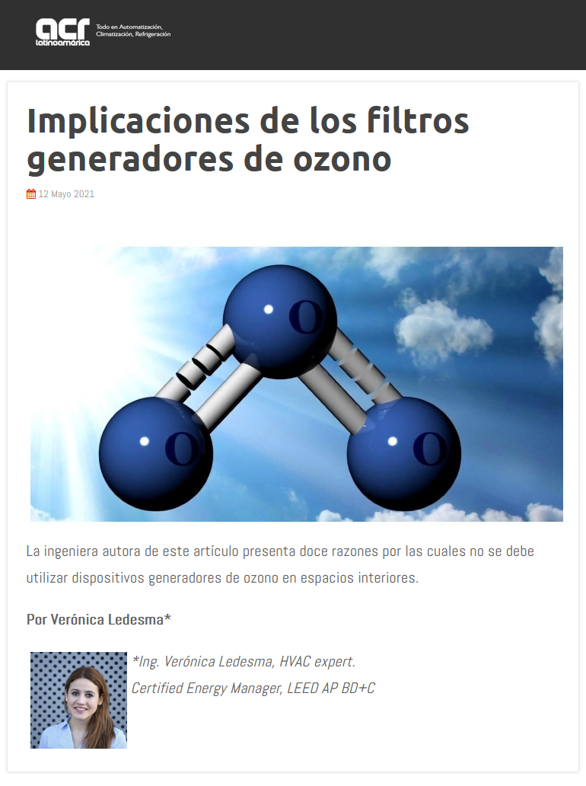
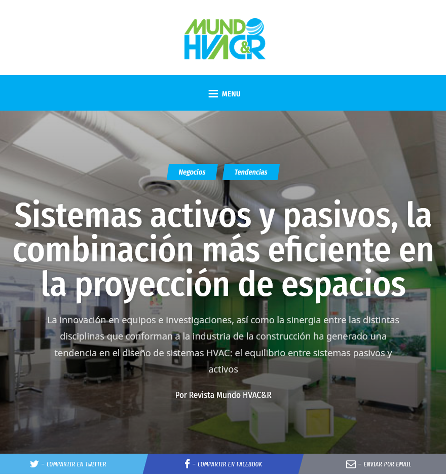

# Videos & Podcasts

<Row>

<Col>

</Col>
<Col>

## Fighting misinformation in HVAC

I participated in the *[ASHRAE Talks "En Español" Podcast](https://open.spotify.com/episode/76WMfIPPAJVSrvfx2mZzAD?si=QG5S3hrZTly42S6oLDmEZg)* where I discussed the implications of misinformation in HVAC topics and why it is so important to fight against it. I made special emphasis to combat fake information e.g., devices falsely advertised as the latest air filtration technology against COVID or COVID-free fake certifications. I also promoted the usage of trustworthy sites such as the latest recommendations published by ASHRAE and CDC. 
</Col>
</Row>

<Row>

<Col>  

## Energy Efficiency in Buildings

In this *Gigantes de la Construcción* podcast episode I talked about the energy efficiency in buildings and about the recommended strategies to ensure indoor air quality during the COVID-19 pandemics.

</Col>

<Col>

</Col>
</Row>

<Row>
<Col>

</Col>
<Col>  

## How much energy is consumed while you are choosing your favorite frozen product?
We are not always conscious about the energy consumption behind our choices. In this video I explain how many kWh are consumed for every minute that you leave a freezer door open at the supermarket.
 
</Col>
</Row>

<Row>
<Col>

## Is it possible to scape through a ventilation duct?
In this video I analyze whether John McClane could have scaped through the ventilation ducts of the Nakatomi Plaza building (Die Hard). I go over an engineering analysis using ASHRAE Fundamentals 2009 and determine the air flowing through a duct with the appropriate size. We calculate the equipment capacity (TR) and analyze the different common systems in high rise buildings while going over some energy efficiency remarks.

</Col>
<Col>

</Col>
</Row>

# Articles

<Row>
<Col>

</Col>
<Col>

## [Implications of ozone-generating filters](https://www.acrlatinoamerica.com/202105129827/articulos/aire-acondicionado-y-ventilacion/implicaciones-de-los-filtros-generadores-de-ozono.html)

Article about the importance of indoor air quality in our everyday lives and elaborates on the implications that ozone has in our health, its air purifying efficiency, and some other impacts that it could have in our surroundings. 

</Col>

</Row>

<Row>
<Col>

## [Active and passive systems, the most efficient combination in a building design](https://www.mundohvacr.com.mx/2015/11/sistemas-activos-y-pasivos-la-combinacion-mas-eficiente-en-la-proyeccion-de-espacios/)

Article about the importance of innovation and multidisciplinary synergy to improve energy performance in buildings. Its goal is to promote new design trends, and to look for a balance between passive and active systems to improve building energy efficiency.

</Col>
<Col>

</Col>
</Row>

